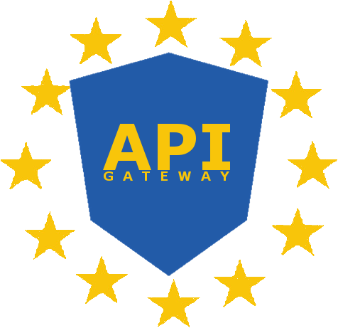
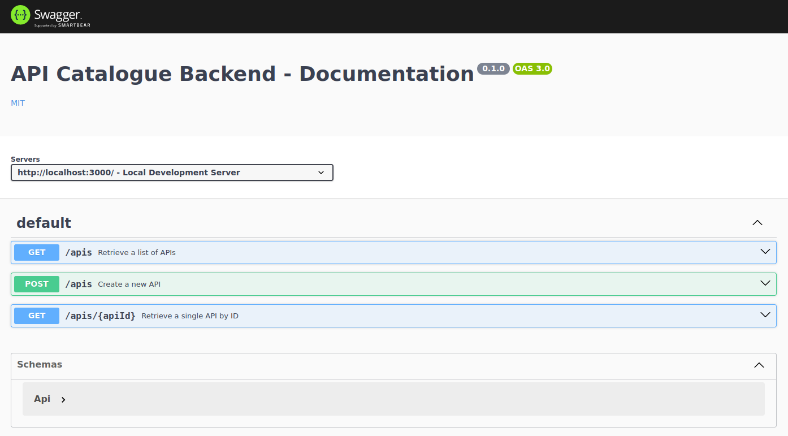
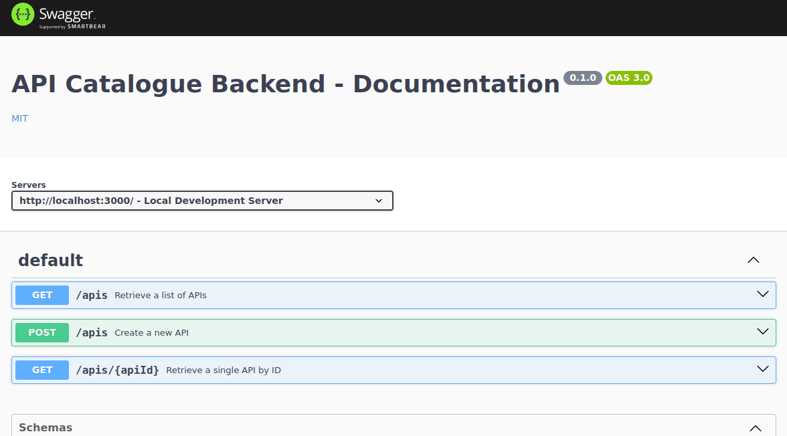
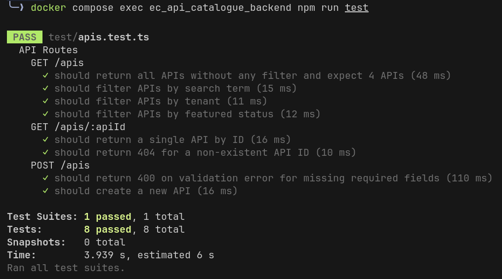

<a name="readme-top"></a>

<!-- PROJECT SHIELDS -->

[![Contributors][contributors-shield]][contributors-url]
[![Forks][forks-shield]][forks-url]
[![Stargazers][stars-shield]][stars-url]
[![Issues][issues-shield]][issues-url]
[![MIT License][license-shield]][license-url]

<!-- PROJECT LOGO -->
<br />
<div align="center">
  <a href="https://code.europa.eu/api-gateway/api-catalogue-backend">
    
  </a>

<h3 align="center">API Catalogue Backend</h3>

  <p align="center">
    A unified backend solution to access, search, filter, and test the APIs of the European Commission across different environments.
    <br />
    <a href="https://citnet.tech.ec.europa.eu/CITnet/confluence/pages/viewpage.action?pageId="><strong>Explore the Confluence docs »</strong></a>
    <br />
    <br />
    <a href="https://code.europa.eu/api-gateway/api-catalogue-backend">View Demo</a>
    ·
    <a href="https://code.europa.eu/api-gateway/api-catalogue-backend/-/issues">Report Bug</a>
    ·
    <a href="https://code.europa.eu/api-gateway/api-catalogue-backend/-/issues">Request Feature</a>
  </p>
</div>

<!-- TABLE OF CONTENTS -->
<details>
  <summary>Table of Contents</summary>
  <ol>
    <li><a href="#about-the-project">About The Project</a>
      <ul>
        <li><a href="#built-with">Built With</a></li>
      </ul>
    </li>
    <li><a href="#getting-started">Getting Started</a>
      <ul>
        <li><a href="#prerequisites">Prerequisites</a></li>
        <li><a href="#installation">Installation</a></li>
        <li><a href="#development-setup">Development Setup</a></li>
        <li><a href="#stopping-the-app-and-managing-data">Stopping the App and Managing Data</a></li>
        <li><a href="#code-quality">Code Quality</a></li>
        <li><a href="#custom-environment-variables">Custom Environment Variables</a></li>
        <li><a href="#building-production-docker-image">Building Production Docker Image</a></li>
      </ul>
    </li>
    <li><a href="#how-to-use">How To Use</a>
      <ul>
        <li><a href="#testing">Testing</a></li>
      </ul>
    </li>
    <li><a href="#folder-structure">Folder Structure</a></li>
    <li><a href="#contributing">Contributing</a></li>
    <li><a href="#license">License</a></li>
    <li><a href="#support">Support</a></li>
  </ol>
</details>

<!-- ABOUT THE PROJECT -->

## About The Project

[](http://api.api-catalogue.tech.ec.europa.eu/)

```sh
# Example usage of the API Catalogue Backend
curl http://api.api-catalogue.tech.ec.europa.eu/apis?tenant=intra&search=notification
```

The API Catalogue Backend is the foundational backend for the API Catalogue project by the European Commission's API Gateway Team. It embodies the principle of reusability, aiming to extend the utility of existing APIs to enhance efficiency and drive innovation within Commission services.

<p align="right">(<a href="#readme-top">back to top</a>)</p>

### Built With

The server configuration leverages a variety of technologies for security, orchestration, and automation:

- [![Docker][Docker-shield]][Docker-url]
- [![Node.js][Node.js-shield]][Node.js-url] - **v20**
- [![TypeScript][TypeScript-shield]][TypeScript-url]
- [![ExpressJS][ExpressJS-shield]][ExpressJS-url]
- [![MongoDB][MongoDB-shield]][MongoDB-url]
- [![GitLab][GitLab-shield]][GitLab-url]

<p align="right">(<a href="#readme-top">back to top</a>)</p>

<!-- GETTING STARTED -->

## Getting Started

To start using the API Catalogue Backend, follow these steps to set up your development environment.

### Prerequisites

Before you begin, ensure you have the following installed on your system:

- **Git**: For cloning the repository.
- **Docker**: For running the application and its services in containers.
- **Node.js**: Preferably the LTS version, to run npm commands.

### Installation

1. Clone the repository:
   ```sh
   git clone https://code.europa.eu/api-gateway/api-catalogue-backend
   ```
2. Navigate to the project directory:
   ```sh
   cd api-catalogue-backend
   ```
3. Install NPM packages:
   ```sh
   npm install
   ```

### Development Setup

To set up the development environment, run:

```sh
docker compose up -d
```

This command will:

- Pull `node:20` to run the app in development mode with hot reload.
- Start a local MongoDB instance with automatic user creation and fake data seeding.
- Launch `mongo-express`, a web-based MongoDB admin interface, automatically connected to the local MongoDB instance.

The services will be available at the following URLs:

| Service Name  | URL                                                                                                     | Description                                                                      |
| ------------- | ------------------------------------------------------------------------------------------------------- | -------------------------------------------------------------------------------- |
| App           | [http://localhost:3000](http://localhost:3000) [http://localhost:3000/docs](http://localhost:3000/docs) | The main application running on port 3000.                                       |
| MongoDB       | mongodb://localhost:27017                                                                               | MongoDB database instance running on port 27017.                                 |
| Mongo-Express | [http://localhost:8081](http://localhost:8081)                                                          | Web-based MongoDB admin interface for database management, running on port 8081. |

### Stopping the App and Managing Data

To stop the application without removing the local data inside MongoDB, simply run:

```sh
docker compose down
```

If you wish to delete the data in the local instance of MongoDB, including all volumes, add the `-v` flag when you tear down the development setup:

```sh
docker compose down -v
```

### Code Quality

No action is required, the code is **automatically linted and formatted upon commit**, ensuring consistent code quality and adherence to standards. For manual linting and formatting:

- To manually lint and format staged files:
  ```sh
  npm run lint-and-format-staged
  ```
- To lint and format the entire repository:
  ```sh
  npm run lint-and-format-repo
  ```

### Custom Environment Variables

To add custom environment variables that is used by the API Catalogue Backend:

1. Add the variable name to `.env.example`, and the variable name and value to your local `.env` file.
2. Recreate the app container:
   ```sh
   docker compose down && docker compose up -d
   ```

### Building Production Docker Image

To build the production Docker image:

```sh
docker build --target prod -t api-catalogue-backend:latest .
```

## How To Use

To develop new API routes or modify existing ones:

1. **Edit Routes**: Navigate to `src/routes/` to adjust or introduce new routes as per your requirements.
2. **Update OpenAPI Spec**: Reflect these changes in the Swagger documentation by updating the OpenAPI specifications located in `src/docs/paths` for route definitions and `src/docs/components` for any new components.

The Swagger UI based on that OpenAPI spec is accessible at http://localhost:3000/docs in the development environment. It provides an interface for the API Catalogue Backend.



<p align="right">(<a href="#readme-top">back to top</a>)</p>

### Testing

The testing framework automatically creates an isolated test database and populates it with test data, all within the local MongoDB Docker container.

To execute the tests, ensure your **docker development environment is running**, and run the following command:

```sh
docker compose exec ec_api_catalogue_backend npm run test
```

This command initiates the test suite within the Node container that runs the application, ensuring that all tests are conducted in an environment identical to the development setup.

All tests should pass, and the output should look like this:



<p align="right">(<a href="#readme-top">back to top</a>)</p>

<!-- FOLDER STRUCTURE AND EXPLANATIONS -->

## Folder Structure

```
.
├── .husky/                   # Configuration for running lint before commit.
├── .vscode/                  # Recommended VSCode configuration for that project.
├── docs/                     # Project level documentation and resources.
│   └── images/               # Images used to illustrate the documentation.
├── src/                      # Source code of the application.
│   ├── docs/                 # The app's OpenAPI specifications.
│   │   ├── components/       # Reusable components for OpenAPI documentation.
│   │   ├── paths/            # Path definitions for API endpoints.
│   │   └── openapi.ts        # Config file that builds the app's OpenAPI spec.
│   ├── middlewares/          # Middlewares for request processing, auth, error...
│   ├── models/               # MongoDB data models.
│   ├── routes/               # Route definitions for the API.
│   ├── utils/                # Utility scripts and helpers.
│   │   └── dev-mongo-init/   # Scripts for initializing MongoDB in development.
│   ├── app.ts                # The file that creates the app, to serve or test.
│   └── server.ts             # The file that serves the app.
├── test/                     # Contains automated tests for the application.
│   ├── config/               # Test configuration files.
│   ├── data/                 # Test data for use in testing environments.
│   └── *.test.ts             # Test files written in TypeScript.
├── .dockerignore             # Lists patterns to exclude from Docker builds.
├── .env                      # Local environment variables (not to be committed).
├── .env.example              # Template for .env file.
├── .eslintrc.yml             # ESLint rules and configurations.
├── .gitignore                # Specifies intentionally untracked files to ignore.
├── .gitlab-ci.yml            # GitLab CI configuration for the CI/CD pipeline.
├── .lintstagedrc.json        # Configuration for lint-staged.
├── .prettierrc               # Prettier code formatting configuration.
├── docker-compose.yml        # Base Docker Compose configuration for development.
├── Dockerfile                # Instructions to build the Docker image for the app.
├── jest.config.ts            # Jest testing framework configuration.
├── LICENSE                   # The license for the project.
├── package-lock.json         # Locked versions of the entire dependency tree.
├── package.json              # NPM package specifications and scripts.
├── README.md                 # This high-level project overview and documentation.
├── tsconfig.json             # TypeScript compiler configuration.
└── webpack.config.js         # Webpack configuration for bundling modules.
```

<p align="right">(<a href="#readme-top">back to top</a>)</p>

<!-- CONTRIBUTING -->

## Contributing

We welcome community involvement:

- **Issues**: Feel free to open issues to report bugs or request features.
- **Pull Requests**: Contributions via pull requests are also welcome.
- **Forking**: Feel free to fork and adapt the project as you like with proper credit.

<p align="right">(<a href="#readme-top">back to top</a>)</p>

<!-- LICENSE -->

## License

Distributed under the MIT License. See `LICENSE` for more information.

<p align="right">(<a href="#readme-top">back to top</a>)</p>

<!-- CONTACT -->

## Support

In case of any issue with this application or to request bug fix or new features, you can reach us:

- DIGIT-APIGTW-SUPPORT@ec.europa.eu
- Our Teams channel GRP-API GATEWAY

API Gateway Team.

<p align="right">(<a href="#readme-top">back to top</a>)</p>

<!-- MARKDOWN LINKS & IMAGES -->
<!-- https://www.markdownguide.org/basic-syntax/#reference-style-links -->

[contributors-shield]: https://img.shields.io/gitlab/contributors/api-gateway%2Fapi-catalogue-backend?gitlab_url=https%3A%2F%2Fcode.europa.eu&style=for-the-badge
[contributors-url]: https://code.europa.eu/api-gateway/api-catalogue-backend/-/graphs/master?ref_type=heads
[forks-shield]: https://img.shields.io/gitlab/forks/api-gateway%2Fapi-catalogue-backend?gitlab_url=https%3A%2F%2Fcode.europa.eu&style=for-the-badge
[forks-url]: https://code.europa.eu/api-gateway/api-catalogue-backend/-/forks
[stars-shield]: https://img.shields.io/gitlab/stars/api-gateway%2Fapi-catalogue-backend?gitlab_url=https%3A%2F%2Fcode.europa.eu&style=for-the-badge
[stars-url]: https://code.europa.eu/api-gateway/api-catalogue-backend/-/starrers
[issues-shield]: https://img.shields.io/gitlab/issues/open/api-gateway%2Fapi-catalogue-backend?gitlab_url=https%3A%2F%2Fcode.europa.eu&style=for-the-badge
[issues-url]: https://code.europa.eu/api-gateway/api-catalogue-backend/-/issues
[license-shield]: https://img.shields.io/gitlab/license/api-gateway%2Fapi-catalogue-backend?gitlab_url=https%3A%2F%2Fcode.europa.eu&style=for-the-badge
[license-url]: https://code.europa.eu/api-gateway/api-catalogue-backend/-/blob/master/LICENSE
[Node.js-shield]: https://img.shields.io/badge/Node.js-43853D?style=for-the-badge&logo=node.js&logoColor=white
[Node.js-url]: https://nodejs.org/
[TypeScript-shield]: https://img.shields.io/badge/TypeScript-3178C6?style=for-the-badge&logo=typescript&logoColor=white
[TypeScript-url]: https://www.typescriptlang.org/
[Docker-shield]: https://img.shields.io/badge/Docker-2496ED?logo=docker&logoColor=fff&style=for-the-badge
[Docker-url]: https://www.docker.com/
[MongoDB-shield]: https://img.shields.io/badge/MongoDB-47A248?logo=mongodb&logoColor=fff&style=for-the-badge
[MongoDB-url]: https://www.mongodb.com/
[GitLab-shield]: https://img.shields.io/badge/GitLab-FC6D26?logo=gitlab&logoColor=fff&style=for-the-badge
[GitLab-url]: https://code.europa.eu/
[ExpressJS-shield]: https://img.shields.io/badge/Express.js-000?logo=express&logoColor=fff&style=for-the-badge
[ExpressJS-url]: https://expressjs.com/
